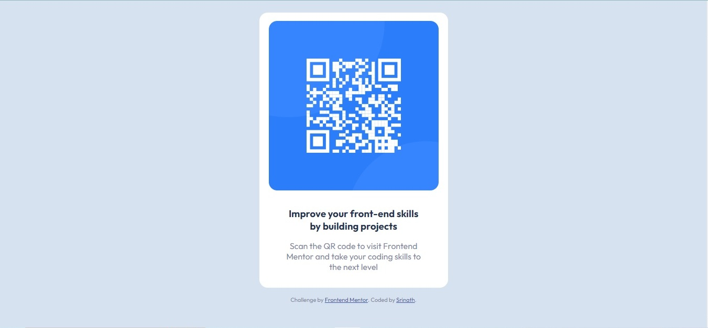

# Frontend Mentor - QR code component solution

This is a solution to the [QR code component challenge on Frontend Mentor](https://www.frontendmentor.io/challenges/qr-code-component-iux_sIO_H). 

## Table of contents

- [Overview](#overview)
  - [Screenshot](#screenshot)
  - [Links](#links)
- [My process](#my-process)
  - [Built with](#built-with)
  - [What I learned](#what-i-learned)
  - [Continued development](#continued-development)
  - [Useful resources](#useful-resources)

## Overview

### Screenshot

### Links

- Solution URL: (https://github.com/Srinath-designer/QR-Code-Component-FrontendMentor)
- Live Site URL: (https://qr-code-component-srinath.netlify.app/)

## My process

### Built with

- Semantic HTML5 markup
- CSS custom properties
- Flexbox
- Mobile-first workflow

### What I learned

Using mobile first approach taught me the basics of responsive layouts. Learned some perfection of layouting using flexbox from this project.

### Continued development

I'm focusing more on the Flexbox formatting and css grid to attain a simple and clean solution to the problem of layouts.

### Useful resources

- [resource 1](https://www.w3schools.com/css/) - Here I learned those css properties which taught me of simple and limited coding approach helps me a lot in this project
